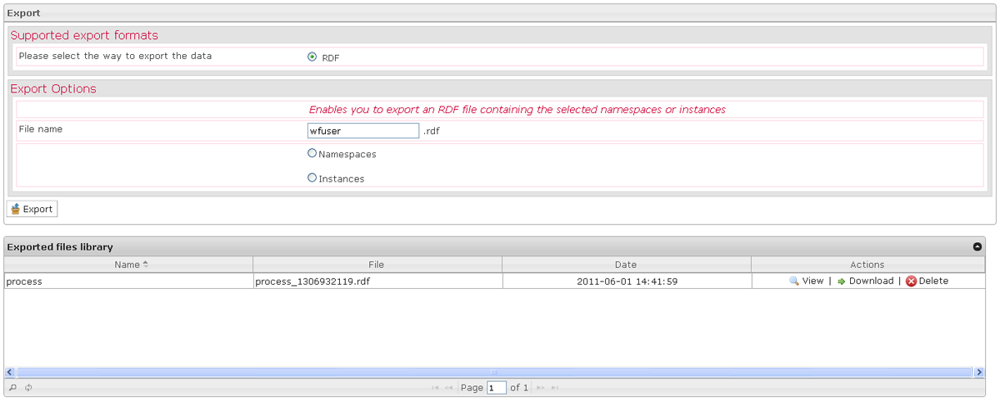

<!--
created_at: '2012-04-18 17:03:45'
updated_at: '2013-03-13 14:35:13'
authors:
    - 'Jérôme Bogaerts'
contributors:
    - 'Sophie Doublet'
tags:
    - 'Manage Roles'
-->

Export
======

The Export box is displayed when a role or a class is selected in the Roles library and when you click on the Export action.

When you export your data, you have just to indicate the data you want.

Export
======

The Export box is displayed when a role or a class is selected in the Roles library and when you click on the Export action.

When you export your data, you have just to indicate the data you want.

