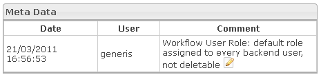

<!--
parent: 'Manage Roles'
created_at: '2012-04-18 17:02:56'
updated_at: '2013-03-13 14:34:38'
authors:
    - 'Jérôme Bogaerts'
contributors:
    - 'Sophie Doublet'
tags:
    - 'Manage Roles'
-->

Meta data
=========

The Meta data box is displayed when a role is selected in the Roles library and when you click on the Meta data action.

You can edit a comment at the selected role. For that you should click on the Edit icon, write a comment in the box which appears and click on the Save button.

