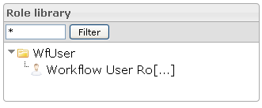

<!--
author:
    - 'Jérôme Bogaerts'
created_at: '2012-03-29 16:27:19'
updated_at: '2013-03-13 14:33:02'
tags:
    - 'Manage Roles'
-->

Role library
============

-   It is possible to put a filter on the roles tree view. Only roles and classes containing the input string will be displayed.
-   When right-clicking the selection in the tree is done, the actions are also displayed as context menu.

Role library
============

-   It is possible to put a filter on the roles tree view. Only roles and classes containing the input string will be displayed.
-   When right-clicking the selection in the tree is done, the actions are also displayed as context menu.

