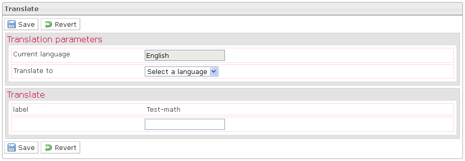

<!--
parent: 'Manage Tests'
created_at: '2012-04-12 17:15:39'
updated_at: '2013-03-13 13:38:01'
authors:
    - 'Jérôme Bogaerts'
contributors:
    - 'Sophie Doublet'
tags:
    - 'Manage Tests'
-->

Translate
=========

In the Test properties pane, when you click on the Translate button, the Translate box is displayed.

The Translate box allows translating the test properties.

