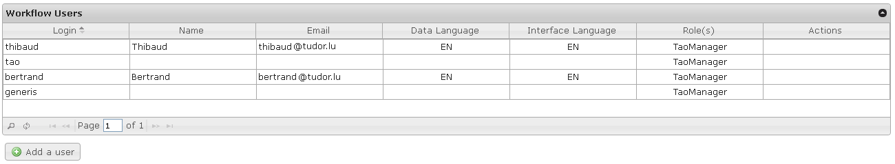

<!--
created_at: '2011-04-22 09:49:29'
updated_at: '2013-03-13 14:35:32'
authors:
    - 'Jérôme Bogaerts'
contributors:
    - 'Franck Gismondi'
tags:
    - Processes
-->

Manage Users
============

The big function of this tab:

Workflow users box
------------------

-   The Workflow users box allows having an overview of the platform users. It is only possible to add, edit and delete users which are created in this section, the others are just visible.

Manage Users
============

The big function of this tab:

Workflow users box
------------------

-   The Workflow users box allows having an overview of the platform users. It is only possible to add, edit and delete users which are created in this section, the others are just visible.

