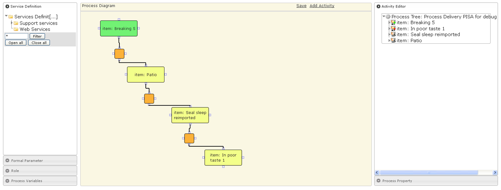

<!--
parent:
    title: Processes
author:
    - 'Jérôme Bogaerts'
created_at: '2011-04-22 09:46:38'
updated_at: '2013-03-13 14:29:27'
tags:
    - Processes
-->

Process Authoring
=================

The big functions of this tab:

Service definition box
----------------------

-   The Service definition box defines the services that will be integrated into an activity.
-   The services are shared with every process which is in advanced mode e.g. modifying a service definition will affect every process that is using it.\
    ~~Question : modification aussi ailleurs ? + en attente documentation développeurs~~

Formal parameter box
--------------------

-   A service definition can receive input parameters (e.g. in case of a test delivery, a required parameter would be the subject’s id).\
    ~~En attente de la documentation développeur pour pousuivre les explications~~

Role box
--------

-   The Role box manages the creation, the edition and the deletion of roles.
-   The Role box defines the allowed users that can execute an activity. A user can have one or several roles. Only users with the right role can run the activity.\
    ~~En attente de la documentation développeurs~~

Process variables box
---------------------

-   The Process variables box defines branching conditions and performing verifications require variables, the values of which depend on the execution of the process.\
    ~~En attente de la documentation développeurs~~

Process diagram box
-------------------

-   The Process diagram provides a process overview with these activities and the different types of connectors. It is possible to add activities and connectors directly in the diagram. All available actions in the diagram are already possible with the activity tree, on the right side of the interface. The main goal of the process diagram thus is to propose an alternative more visual of the creation tool of process.\
    ~~En attente de la documentation développeurs~~

Activity editor box
-------------------

-   The Activity editor box allows creating activities and editing the connectors that define the workflow logic. The dynamic activity arborescence summarizes the workflow being edited. Every action can be done on the workflow with a right-click contextual menu.\
    ~~En attente de la documentation développeurs~~

Process properties box
----------------------

-   The Process properties box allows editing general properties of the current process, i.e. label, name and associated process variables.\
    ~~En attente de la documentation développeurs~~

Compilation box
---------------

-   The Compilation box compiles the activities composing the selected process. The compilation is necessary for the process execution.\
    ~~En attente de la documentation développeurs~~

