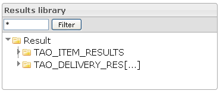
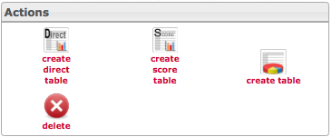
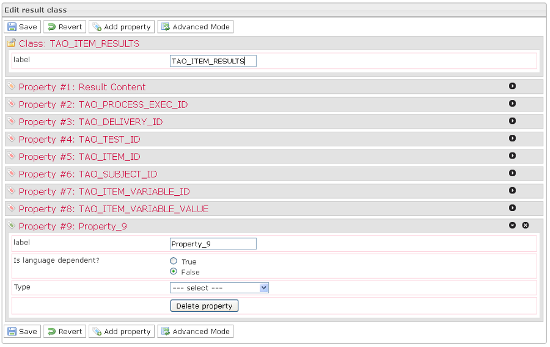
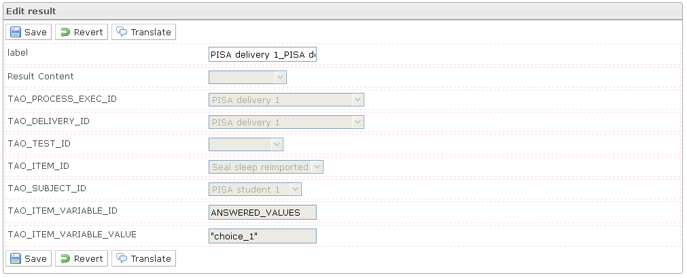
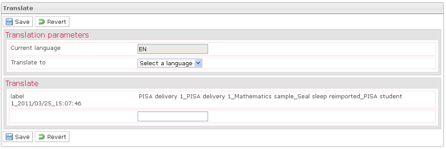
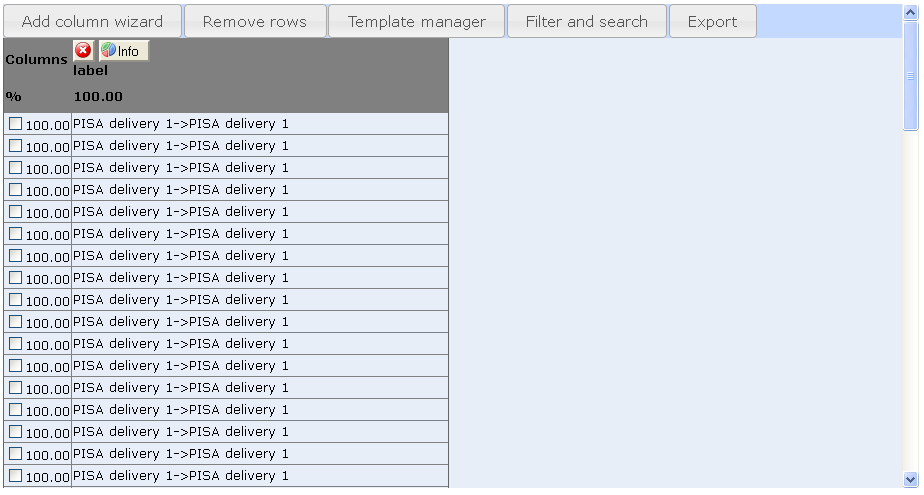
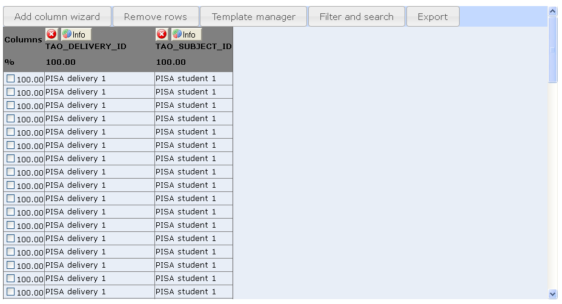
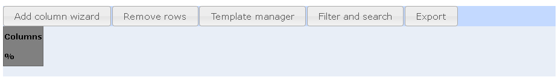

<!--
parent: Results
created_at: '2011-04-22 09:25:34'
updated_at: '2013-03-13 14:23:04'
authors:
    - 'Jérôme Bogaerts'
contributors:
    - 'Franck Gismondi'
tags:
    - Results
-->

Manage Results
==============

The big functions of this tab:

Results library box
-------------------

-   It is possible to put a filter on the results tree view. Only results and classes containing the input string will be displayed.
-   When right-clicking the selection in the tree is done, the actions are also displayed as context menu.
-   The classes tree supports drag and drop moving of results into a different class.

Actions box
-----------

-   According to your actions in the interface, the actions icons will be activated or deactivated.

Edit result class box
---------------------

-   The Edit result class box is displayed when a class is selected in the Results library.
-   The Edit result class box does not provide the possibility creating, modifying or deleting properties. Indeed, the properties are automatically created depending the delivery of the results stored.

Edit result box
---------------

-   The Edit result box is displayed when a result is selected in the Results library box.
-   The Edit result box provides the result properties which are defined in the parent classes properties and are available for modification.

Translate box
-------------

-   In the Edit result box, when you click on the Translate button, the Translate box is displayed.
-   The Translate box allows translating the result properties.

Create direct table box
-----------------------

-   The Create direct table box is displayed when a class is selected in the Results library box and when you click on the Create direct table action.
-   The Create direct table action automatically creates a table by using the properties of the selected class. The created table is displayed in the Create direct table box.

Create score table box
----------------------

-   The Create score table box is displayed when a class is selected in the Results library box and when you click on the Create score table action.
-   The Create score table action automatically creates a table by using only the scoring properties of the selected class. The created table is displayed in the Create score table box.

Create table box
----------------

-   The Create table box is displayed when a class is selected in the Items library and when you click on the Create table action.
-   The Create table box is a workspace where it is possible to build a table to view data selected among all the data that can be viewed on the platform.

