<!--
parent:
    title: Test_takers
author:
    - 'Jérôme Bogaerts'
created_at: '2011-04-22 08:59:49'
updated_at: '2013-03-13 13:40:41'
tags:
    - 'Test takers'
-->

Manage Test Takers
==================

The main functions of this tab:

Test takers library
-------------------

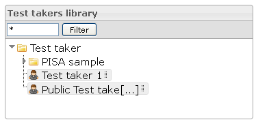

-   It is possible to put a filter on the test takers tree view. Only test takers and classes containing the input string will be displayed.
-   When right-clicking the selection in the tree is done, the actions are also displayed as context menu.
-   The classes tree supports drag and drop moving of test takers into a different class.

Actions
-------

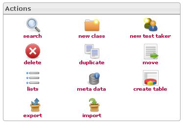

-   According to your actions in the interface, the actions icons will be activated or deactivated.

Edit test taker class
---------------------

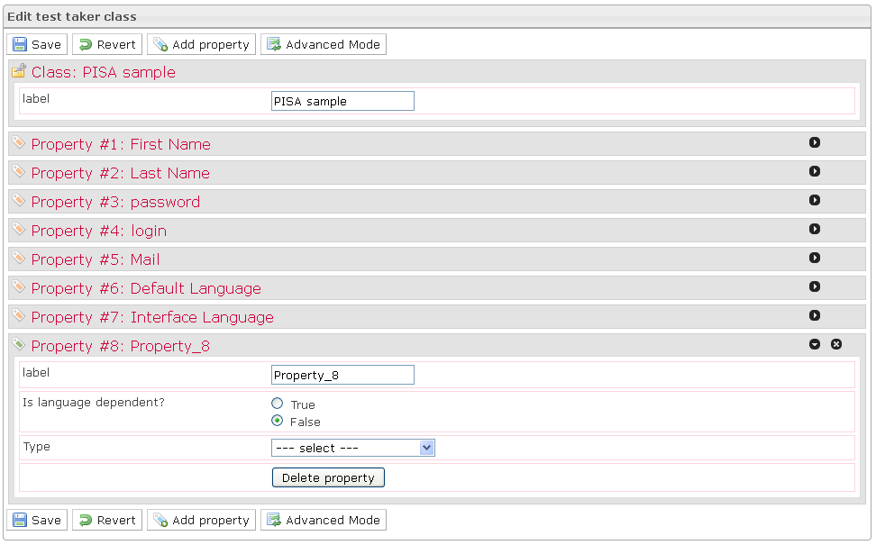

-   The Edit test taker class box is displayed when a class is selected in the Test takers library.
-   The Edit test taker class box provides the possibility creating, modifying or deleting properties. These properties define parameters to define when creating test takers of class.
-   Ten properties are predefined as they constitute the specifications of a test taker: Label, First name, Last name, Login, Mail, Default language, Interface language, Old password, New password and Repeat new password.
-   The Simple mode allows creating properties from widgets and previously created lists.
-   The Advanced mode allows creating properties from widgets and all resources of the platform.

Add to group
------------

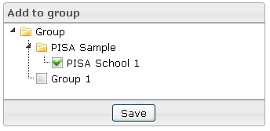

-   The Add to group box is displayed when a test taker is selected in the Test takers library box.
-   A group is composed by test takers, and this box allows choosing the group(s) where the selected test taker should be.

Edit test taker
---------------

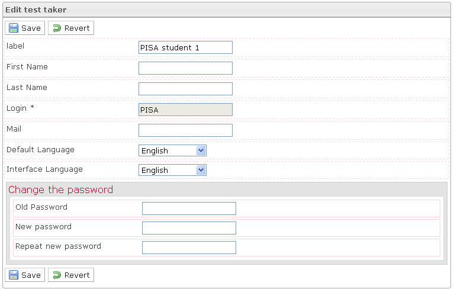

-   The Edit test taker box is displayed when a test taker is selected in the Test takers library box.
-   The Edit test taker box provides the test taker properties which are defined in the parent classes properties and are available for modification.

Search
------

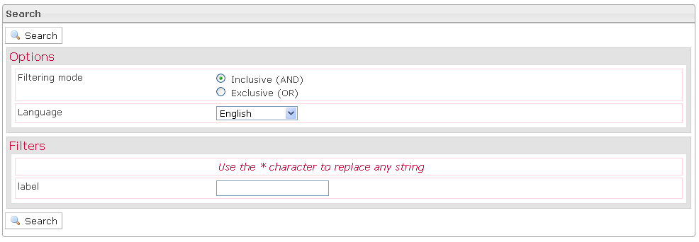

-   The Search box is displayed when you click on the Search action, in the Actions box.
-   In the first part of the Search box, you should define the search options which permit to refine search results.
-   In the second part of the Search box, you should define one filter to minimum to allow the search.

Move to
-------

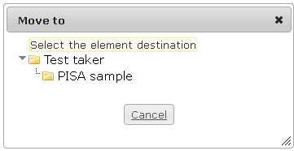

-   The Move to box is displayed when a test taker is selected in the tree and when you click on the Move action (in the right-click menu or in the Actions box).
-   To move a test taker, just click on the target class.

Create a list
-------------

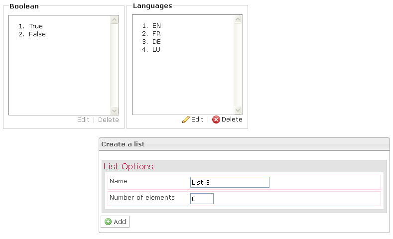

-   The Create a list box is displayed when you click on the Lists action.
-   To create a list, just define the name and the number of elements.
-   After that, you must edit the elements in the created list and save it.

Meta data
---------

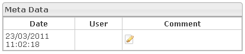

-   The Meta data box is displayed when a test taker is selected in the Test takers library and when you click on the Meta data action.
-   You can edit a comment at the selected item. For that you should click on the Edit icon, write a comment in the box which appears and click on the Save button.

Create table
------------

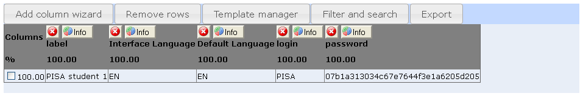

-   The Create table box is displayed when a class is selected in the Items library and when you click on the Create table action.
-   The Create table box is a workspace where it is possible to build a table to view data selected among all the data that can be viewed on the platform.

Export
------

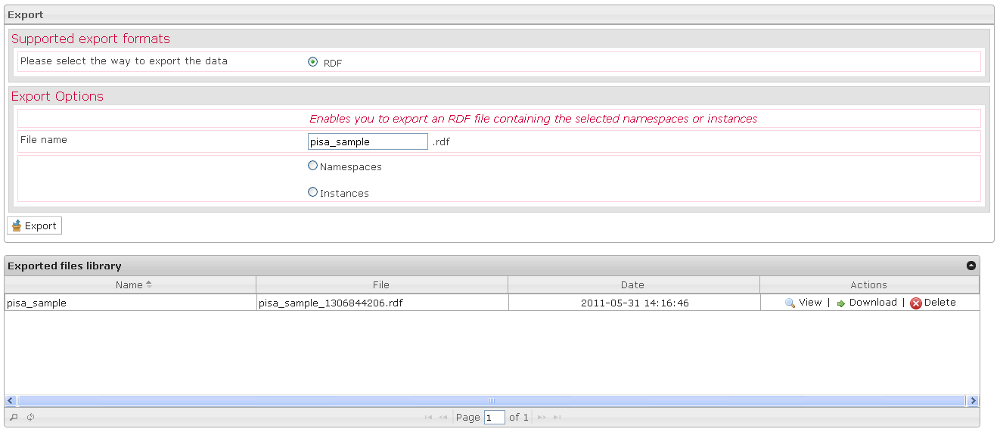

-   The Export box is displayed when a test taker or a class is selected in the Test takers library and when you click on the Export action.
-   When you export your data, you have just to indicate the data you want.

Import
------

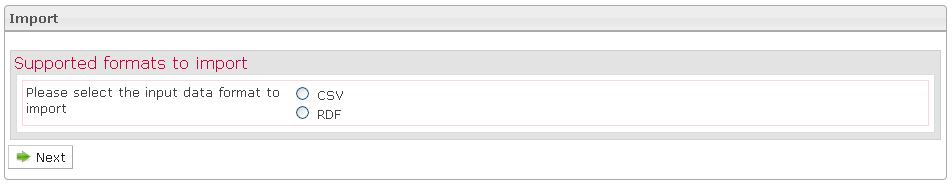

-   The Import box is displayed when a class is selected in the Test takers library and when you click on the Import action.
-   You can import your data to CSV or to RDF.
-   If you choose to import your data to CSV, the import is occurring in three steps: first define the common options of your CSV file, second select your file in your file system by clicking the Browse button and thirdly map the columns of your CSV file to the properties of your class.
-   If you choose to import your data to RDF, you must indicate the RDF item you want to import.

