<!--
author:
    - 'Jérôme Bogaerts'
created_at: '2011-04-21 16:48:00'
updated_at: '2013-03-13 13:36:15'
tags:
    - Tests
-->

Manage Tests
============

The big functions of this tab:

Tests library box
-----------------

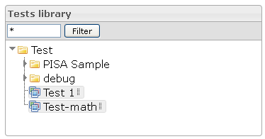

-   It is possible to put a filter on the tests tree view. Only tests and classes containing the input string will be displayed.
-   When right-clicking the selection in the tree is done, the actions are also displayed as context menu.
-   The classes tree supports drag and drop moving of tests into a different class.

Actions box
-----------

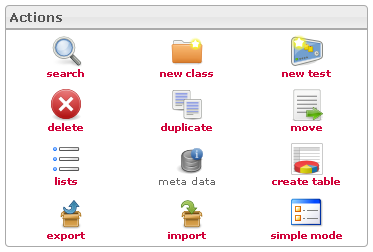

-   According to your actions in the interface, the actions icons will be activated or deactivated.

Edit test class box
-------------------

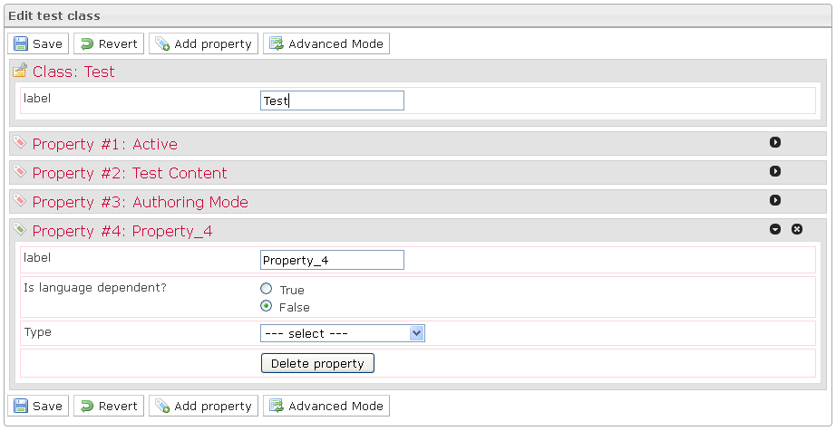

-   The Edit a class box is displayed when a class is selected in the Tests library.
-   The Edit a class box provides the possibility creating, modifying or deleting properties. These properties define parameters to define when creating tests of class.
-   Two properties are predefined as they constitute the specification of a test: Label, Active.
-   The Simple mode allows creating properties from widgets and previously created lists.
-   The Advanced mode allows creating properties from widgets and all resources of the platform.

Select related items box
------------------------

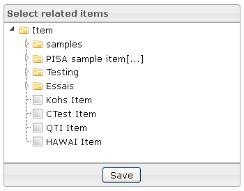

-   The Select related items box is displayed when a test is selected in the Tests library.
-   A test is composed by items, and this box allows choosing the items which will compose the selected test.

Items sequence box
------------------

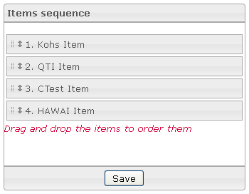

-   The Items sequence box is displayed when a test is selected in the Tests library.
-   The Items sequence box allows putting the items in sequence order.

Test properties box
-------------------

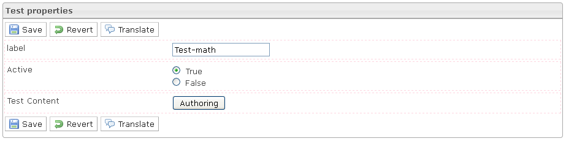

-   The Test properties box is displayed when a test is selected in the Tests library.
-   The Test properties box provides the test properties which are defined in the parent classes properties and are available for modification.
-   The Active property defines if a test is active or not. If a test is not active, it cannot be included in a delivery.

Translate box
-------------

-   In the Test properties box, when you click on the Translate button, the Translate box is displayed.
-   The Translate box allows translating the test properties.

Search box
----------

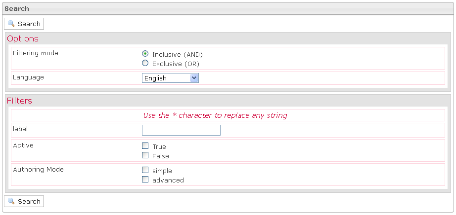

-   The Search box is displayed when you click on the Search action, in the Actions box.
-   In the first extension of the Search box, you should define the search options which permit to refine search results.
-   In the second extension of the Search box, you should define one filter minimum to allow the search.

Move to box
-----------

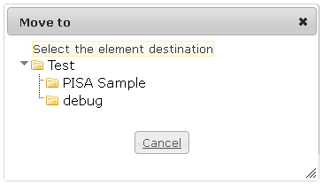

-   The Move to box is displayed when a test is selected in the tree and when you click on the Move action (in the right-click menu or in the Actions box).
-   To move a test, just click on the target class.

[[User Guide]]\>Parts presentation\>[[Tests]]\>Manage Tests\>Create a list box

Create a list box
-----------------

-   The Create a list box is displayed when you click on the Lists action.
-   To create a list, just define the name and the number of elements.
-   After that, you must edit the elements in the created list and save it.

Meta data box
-------------

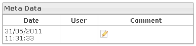

-   The Meta data box is displayed when a test is selected in the Tests library and when you click on the Meta data action.
-   You can edit a comment at the selected test. For that you should click on the Edit icon, write a comment in the box which appears and click on the Save button.

[[User Guide]]\>Parts presentation\>[[Tests]]\>Manage Tests\>Create a list box

Create table box
----------------

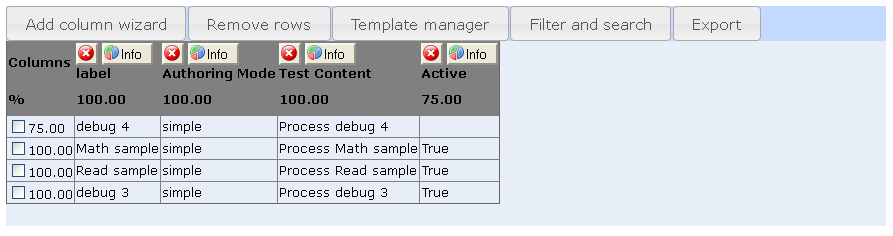

-   The Create table box is displayed when a class is selected in the Tests library and when you click on the Create table action.
-   The Create table box is a workspace where it is possible to build a table to view data selected among all the data that can be viewed on the platform.

Export box
----------

-   The Export box is displayed when a test or a class is selected in the Tests library and when you click on the Export action.
-   When you export your data, you have just to indicate the data you want.

Import box
----------

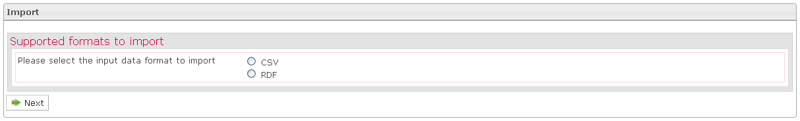

-   The Import box is displayed when a class is selected in the Tests library and when you click on the Import action.
-   You can import your data to CSV or to RDF.
-   If you choose to import your data to CSV, the import is occurring in three steps: first define the common options of your CSV file, second select your file in your file system by clicking the Browse button and thirdly map the columns of your CSV file to the properties of your class.
-   If you choose to import your data to RDF, you must indicate the RDF item you want to import.

Manage Tests
============

The big functions of this tab:

Tests library box
-----------------

-   It is possible to put a filter on the tests tree view. Only tests and classes containing the input string will be displayed.
-   When right-clicking the selection in the tree is done, the actions are also displayed as context menu.
-   The classes tree supports drag and drop moving of tests into a different class.

Actions box
-----------

-   According to your actions in the interface, the actions icons will be activated or deactivated.

Edit test class box
-------------------

-   The Edit a class box is displayed when a class is selected in the Tests library.
-   The Edit a class box provides the possibility creating, modifying or deleting properties. These properties define parameters to define when creating tests of class.
-   Two properties are predefined as they constitute the specification of a test: Label, Active.
-   The Simple mode allows creating properties from widgets and previously created lists.
-   The Advanced mode allows creating properties from widgets and all resources of the platform.

Select related items box
------------------------

-   The Select related items box is displayed when a test is selected in the Tests library.
-   A test is composed by items, and this box allows choosing the items which will compose the selected test.

Items sequence box
------------------

-   The Items sequence box is displayed when a test is selected in the Tests library.
-   The Items sequence box allows putting the items in sequence order.

Test properties box
-------------------

-   The Test properties box is displayed when a test is selected in the Tests library.
-   The Test properties box provides the test properties which are defined in the parent classes properties and are available for modification.
-   The Active property defines if a test is active or not. If a test is not active, it cannot be included in a delivery.

Translate box
-------------

-   In the Test properties box, when you click on the Translate button, the Translate box is displayed.
-   The Translate box allows translating the test properties.

Search box
----------

-   The Search box is displayed when you click on the Search action, in the Actions box.
-   In the first extension of the Search box, you should define the search options which permit to refine search results.
-   In the second extension of the Search box, you should define one filter minimum to allow the search.

Move to box
-----------

-   The Move to box is displayed when a test is selected in the tree and when you click on the Move action (in the right-click menu or in the Actions box).
-   To move a test, just click on the target class.

[[User Guide]]\>Parts presentation\>[[Tests]]\>Manage Tests\>Create a list box

Create a list box
-----------------

-   The Create a list box is displayed when you click on the Lists action.
-   To create a list, just define the name and the number of elements.
-   After that, you must edit the elements in the created list and save it.

Meta data box
-------------

-   The Meta data box is displayed when a test is selected in the Tests library and when you click on the Meta data action.
-   You can edit a comment at the selected test. For that you should click on the Edit icon, write a comment in the box which appears and click on the Save button.

[[User Guide]]\>Parts presentation\>[[Tests]]\>Manage Tests\>Create a list box

Create table box
----------------

-   The Create table box is displayed when a class is selected in the Tests library and when you click on the Create table action.
-   The Create table box is a workspace where it is possible to build a table to view data selected among all the data that can be viewed on the platform.

Export box
----------

-   The Export box is displayed when a test or a class is selected in the Tests library and when you click on the Export action.
-   When you export your data, you have just to indicate the data you want.

Import box
----------

-   The Import box is displayed when a class is selected in the Tests library and when you click on the Import action.
-   You can import your data to CSV or to RDF.
-   If you choose to import your data to CSV, the import is occurring in three steps: first define the common options of your CSV file, second select your file in your file system by clicking the Browse button and thirdly map the columns of your CSV file to the properties of your class.
-   If you choose to import your data to RDF, you must indicate the RDF item you want to import.

