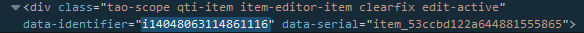

<!--
author:
    - 'Dieter Raber'
created_at: '2014-07-02 12:01:45'
updated_at: '2014-07-21 09:45:05'
tags:
    - 'Tutorial - How to customize the look of items'
-->

Tutorial - Using a custom font on items
=======================================

CSS offers several ways to work with fonts. Traditionally designers rely on fonts that are installed on the target computer which is the process that happens when selecting a font family in the *Style Editor*. Unfortunately very few fonts are available cross-OS so there is not a 100% guarantee that your item will look the same in every browser/device/OS.

The modern approach is to use the CSS `@font-face` rule which is [well supported](http://caniuse.com/#feat=fontface). It allows you to use a custom font as a resource that is automatically downloaded from the server and then applied to your web page. You can still not be sure everything looks exactly the same everywhere but the chances are way better. In most scenarios you would use a third party service such as [Google Fonts](https://www.google.com/fonts#UsePlace:use/Collection:Droid+Sans). This is not an option for *Items* unless you can be sure the student’s machine is connected to the internet. Thus the best practice is to store the font along with the item.

In this tutorial we are using [Droid Sans](http://www.fontsquirrel.com/fonts/Droid-Sans). There are actually pre-compiled webfont kits available but for the sake of the tutorial we will re-create one from scratch.

1\. Download [a copy of the \*.ttf (archived)](http://www.fontsquirrel.com/fonts/Droid-Sans) and unpack it.\
2. Got to http://www.fontsquirrel.com/tools/webfont-generator and upload the two \*.ttf files\
3. Optionally select *Expert* and adapt the settings for your font. We recommend to check *Base64 Encode* because at this point TAO offers no possibility to upload fonts or other assets through the web interface. If you don’t want to use base64 encoding you will need to add the fonts manually to `/tao/generis/data/taoItems/itemData/ITEM_ID/itemContent/en-US`. To find the Item Id you need to inspect the source code of the item in your console of your browsers, search for `data-identifier`:

.\
Screen shot taken in Firefox, this item has the identifier `i14048063114861116` and is hence located at `/tao/generis/data/taoItems/itemData/i14048063114861116/itemContent/en-US`\
4. If you want to use different styles of the same family (e.g. /bold/ or *italic*) you will need a provide a font file for each of them.\
5. Download the web font kit

You can use the style sheet from the kit as is, the file [mod-droid-sans.css](../resources/mod-droid-sans.css) contains comments that explain the best practices to complete this task.

Tutorial - Using a custom font on items
=======================================

CSS offers several ways to work with fonts. Traditionally designers rely on fonts that are installed on the target computer which is the process that happens when selecting a font family in the *Style Editor*. Unfortunately very few fonts are available cross-OS so there is not a 100% guarantee that your item will look the same in every browser/device/OS.

The modern approach is to use the CSS `@font-face` rule which is [well supported](http://caniuse.com/#feat=fontface). It allows you to use a custom font as a resource that is automatically downloaded from the server and then applied to your web page. You can still not be sure everything looks exactly the same everywhere but the chances are way better. In most scenarios you would use a third party service such as [Google Fonts](https://www.google.com/fonts#UsePlace:use/Collection:Droid+Sans). This is not an option for *Items* unless you can be sure the student’s machine is connected to the internet. Thus the best practice is to store the font along with the item.

In this tutorial we are using [Droid Sans](http://www.fontsquirrel.com/fonts/Droid-Sans). There are actually pre-compiled webfont kits available but for the sake of the tutorial we will re-create one from scratch.

1\. Download [a copy of the \*.ttf (archived)](http://www.fontsquirrel.com/fonts/Droid-Sans) and unpack it. 

2. Got to http://www.fontsquirrel.com/tools/webfont-generator and upload the two \*.ttf files\
3. Optionally select *Expert* and adapt the settings for your font. We recommend to check *Base64 Encode* because at this point TAO offers no possibility to upload fonts or other assets through the web interface. If you don’t want to use base64 encoding you will need to add the fonts manually to `/tao/generis/data/taoItems/itemData/ITEM_ID/itemContent/en-US`. To find the Item Id you need to inspect the source code of the item in your console of your browsers, search for `data-identifier`:

. 

Screen shot taken in Firefox, this item has the identifier `i14048063114861116` and is hence located at `/tao/generis/data/taoItems/itemData/i14048063114861116/itemContent/en-US`\
4. If you want to use different styles of the same family (e.g. /bold/ or *italic*) you will need a provide a font file for each of them. 

5. Download the web font kit

You can use the style sheet from the kit as is, the file [mod-droid-sans.css](../resources/mod-droid-sans.css) contains comments that explain the best practices to complete this task.

