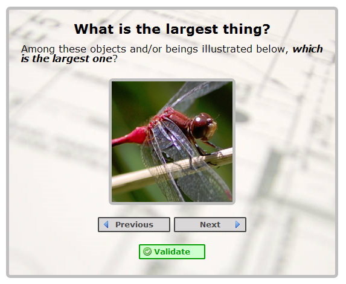
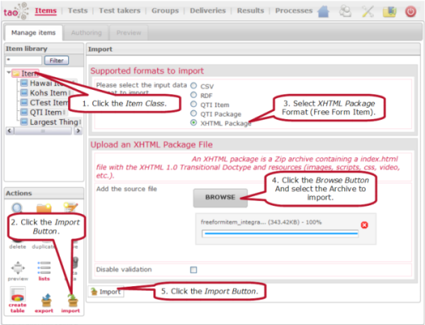

<!--
parent:
    title: Tutorials
author:
    - 'Bertrand Chevrier'
created_at: '2011-02-11 12:22:06'
updated_at: '2013-10-18 15:51:03'
tags:
    - Tutorials
-->

{{\>toc}}

Open WEB Items
==============

Useful resources
----------------

-   \*[HTML5 starter package](http://forge.taotesting.com/attachments/download/2633/owi-stub.zip*)
-   \*[Item API Stub](http://forge.taotesting.com/attachments/download/2637/taoItemApi-stub.js*)
-   **[[Item API|Item API documentation]]**

1. Definition
-------------

Sometimes, the pre-defined types of items available in TAO such as QTI are not rich enough to meet the requirements of a particular item. A solution exists: Open WEB Items.

Open WEB Items are a new generation of assessment items based on standard Web technologies: HTML, CSS and JavaScript (HTML5/CSS3 regarding the support of the test taker’s browser). Open WEB Items let you use these technologies as you want them to be used to create items that exactly suits your needs. In this way, a developer with basic Web development skills will be able to develop his own item as a *small web application* with the tools he is used to deal with, and connect them to the TAO platform using the [[Item API]].

Open WEB Items are not only designed to create items from scratch. If you already developed items as web applications, the cost to modify them and make them compliant with TAO is very light. The only thing to do will be to integrate your scoring method using the [[Item API]].

2. Your first Open WEB Item
---------------------------

*“This tutorial is not designed to teach you the basics of Web Development and related technologies. Fortunately, thousands of resources on the Internet widely describe HTML, CSS and JavaScript.”*

In this section you will learn how to create your first Open WEB Item. The following tutorial is organised as followed:

-   Get a “ready-to-transform” Web application as a basis.
-   Transform this Web application to integrate the TAO APIs.
-   Package and import the item into a TAO Platform instance.

###2.1. An existing Web application as a Open WEB Item{#21-an-existing-web-application-as-a-open-web-item}

The first step of this tutorial consists in download and inspect [an existing Web application](http://forge.taotesting.com/attachments/download/2640/my-first-owi-stub.zip) that we provide you. You can make work this item *out of the box* to get an overview. To do so, unzip the archive on your file system, and double-click the `index.html` file.

Your web browser opens up and you should see an item asking the test taker to select the *Largest thing* among a series of concepts, things or beings. The test taker presses the *Next* or *Previous* buttons to change his answer. He finally presses the *Validate* button to validate its answer and continue the current test. If you press the *Validate* button, nothing happens. At this stage, this is absolutely normal. We still have to invoke the relevant methods in the *Item API* to provide the TAO Delivery Engine a *Score*.

The structure of the item is architectured as followed:

    my-first-owu
    |-- index.html                      An HTML file describing the content of the item. This is the entry point of our Web application/item. Any Open WEB Item must contain a file named 'index.html' which is the first loaded file when the item is delivered by TAO.
    |-- img                             A folder containing the images used by the item.
    |   |-- background.jpg
    |   |-- background.jpg
    |   |-- background.jpg
    |   |-- background.jpg
    |   `-- background.jpg
    |
    |-- scripts                         A folder containing the JavaScript source code used by the item.
    |   |-- jquery-1.4.4.min.js         This item uses the jQuery library. http://jquery.com is a lightweight JavaScript library that provides you multiple APIs to make web development easier.
    |   |-- jquery.imgpreload.min.js    A jQuery plugin that helps with image preloading.
    |   `-- biggestthing.js             The JavaScript source code specific to our items. This is where the main logic of the item is described.
    |
    `-- styles                          A folder containing the CSS stylesheet of our item.
        `-- background.jpg              The CSS style sheet decorating the item.

*“The general structure of this item was chosen arbitrarily. When you develop a Open WEB Item, you can organize its content as you want. The only convention to respect is to put an `index.html` file, acting as the entry point of your item, at the root of the folder hierarchy like in the organization above.”*

###2.2. TAO Item API integration{#22-tao-item-api-integration}

The [[Item API]] contains different implementations : one for the preview in TAO, one for the delivery time and one for the development.\
Once the item is into TAO, the [[Item API]] is loaded **automatically** into your item. But to help you at the level of the item development you can include the [taoItemApi-stub.js](http://forge.taotesting.com/attachments/download/2637/taoItemApi-stub.js) into your item. It contains the development implementation plus a mechanism that starts it if the item isn’t in TAO.

Download it and add a reference at the end of the `index.html` file.

####Modify the stub of the Item{#modify-the-stub-of-the-item}

We will now add the JavaScript instructions needed to interact with TAO when the test taker clicks on the *Validate* button, at the bottom of the Open WEB Item. First, locate the following instructions at the end of the `scripts/biggestthing.js` file.

    window.onItemApiReady = function(itemApi){
        init(function onValidateClicked(e){

        });
    };

The function `onItemApiReady` must be defined globally as the *Item API* will look for it and give it an instance of the `itemApi` pseudo-class.

The callback `onValidateClicked` function is invoked when the test taker presses the *Validate* button. At this moment, we want to inform the TAO platform about 3 things:

-   ***Score***: What is the Score of the item? In this Free Form Item, we arbitrary decide that if the test taker selected the correct image *Score* = 1, otherwise *Score* = 0.
-   ***Endorsment***: Regarding the score, is the answer *Correct* or *Wrong*? This information could be used further in the test to dynamically select another one.
-   ***State***: Alert TAO that the *State* of the item is *Finished*. In this way, the platform knows that the user can access the next item in the test.

To do so, modify the `onValidateClicked` method body like this:

    window.onItemApiReady = function(itemApi){
        init(function onValidateClicked(){
            // The value of window.currentThing contains a numeric information
            // illustrating the selected image.
            itemApi.saveResponses({'CURRENT_THING' : window.currentThing});

            if (window.currentThing == 1) {
                    itemApi.saveScores({'SCORE' : 1});
            } else {
                    itemApi.saveScores({'SCORE' : 0});
            }

            //disable actions once validated
            itemApi.beforeFinish(function disableActions(){
                    changeButtonState($('#validate'), true);{#validate-true}

                    changeButtonState($('#next'), true);{#next-true}

                    changeButtonState($('#previous'), true);{#previous-true}

            });

            itemApi.finish();
        });
    };

Let us review this.

-   1\. First **we check the value of the `window.currentThing` variable**. The latter contains an index, from 0 to 3. Each value of this index corresponds to an image that the test taker can select. 0 = Car, 1 = Plane, 2 = Dragonfly, 3 = Pie. The answered value is saved using the *Item API* method `saveResponses`. All responses must be identified by a key, here we use the key `'CURRENT_THING'`.
-   2\. **If the answer is correct**, we set the *Score* using the `saveScores` method of the *Item API*. The answer is correct so that we give an arbitrary score of *1*.
-   3\. **If the answer is not correct**, we do the inverse.
-   5\. **We add behavior to execute before the item finishes**, by adding a callback to the *Item API*’s method `beforeFinish`.
-   4\. Finally, **we notify TAO that this item is finished** by invoking the `finish` method of the Item Runtime API.

If you do not want to modify the source code on yourself, you can download the item in its [final form](http://forge.taotesting.com/attachments/download/2640/my-first-owi-stub.zip).

3. Packaging and Import
-----------------------

We are now ready to package and import our item into TAO. A Open WEB Item is packaged as a Zip archive that fulfils the following conventions:

-   Its **entry point is *index.html*** and is **placed at the root** of the Zip archive.
-   **All files** referenced by XHTML files and CSS stylesheets **must be included in the archive**. In other words, put in the package all files that are needed to execute your item as a *Web application*, including the JavaScript *TAO Runtime Item* and/or *TAO Scoring APIs*.

Once your Open WEB Item is packaged as a Zip archive, you can import it into a TAO Platform instance. If you not have a running assessment platform, please refer to [[Requirements]] and [[Installation and Upgrading]] sections of this Wiki. An other solution is to use the *TAO Demonstration Platform* at <http://demo.tao.lu>.

To import your Open WEB Item into TAO:

-   Log in your TAO Platform and go to the *Items Module*.
-   Click the *Item Class* in the *Item Library*.
-   Click the *Import* button in the *Actions* panel.
-   Select the *XHTML Package* format.
-   Click the *Browse Button* and select your Zip Archive.
-   Click the *Import Button* at the bottom of the Form.

**Your Open WEB Item is now ready to use! You can change its label, include it in a test and a delivery to make it available to your test takers!**

