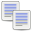
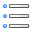

<!--
created_at: '2011-03-11 13:49:56'
updated_at: '2013-03-13 13:16:03'
authors:
    - 'Jérôme Bogaerts'
contributors:
    - 'Franck Gismondi'
tags:
    - 'User Guide'
-->

Actions
=======

In the Actions pane, you can perform different actions depending on the current activity:

 Advanced mode
-----------------------------------------

To activate the advanced mode of the editor (specific to the Tests and Deliveries parts)

 Compile
------------------------------

To compile the tests of the selected delivery (specific to the Deliveries part)

 Create table
---------------------------------------

To create a data table from a selected class

 Create direct table
----------------------------------------------------

To create a data table with all properties from a selected class (specific to the Results part)

 Create score table
--------------------------------------------------

To create a data table with only score properties from a selected class (specific to the Results part)

 Delete
----------------------------

To delete the selected element

 Duplicate
----------------------------------

To duplicate the selected element (all parts except Processes and Results)

 Export
----------------------------

To export the selected element (all parts except Processes and Results)

 Import
----------------------------

To import data under the selected class (all parts except Processes and Results)

 Lists
--------------------------

To manage the lists, thereafter, used in the class properties (all parts except Deliveries, Processes and Results)

 Meta data
---------------------------------

To add a comment to the selected element (all parts except Deliveries and Results)

 Move
------------------------

To move the selected element (all parts except Processes and Results)

 New campaign
---------------------------------------

To add a campaign under the selected class (specific to the Deliveries part)

 New class
---------------------------------

To add a class under the selected class

 New delivery
---------------------------------------

To add a delivery under the selected class (specific to the Deliveries part)

 New group
---------------------------------

To add a group under the selected class (specific to the Groups part)

 New item
-------------------------------

To add an item under the selected class (specific to the Items part)

 New process
-------------------------------------

To add a process under the selected class (specific to the Processes part)

 New result
-----------------------------------

To add a result under the selected class (specific to the Results part)

 New result server
-------------------------------------------------

To add a result server under a selected class (specific to the Deliveries part)

 New role
-------------------------------

To add a role under the selected class (specific to the Processes part)

 New test
-------------------------------

To add a test under the selected class (specific to the Tests part)

 New test taker
------------------------------------------

To add a test taker under the selected class (specific to the Test takers part)

 Preview
------------------------------

To visualize the selected item (specific to the Items part)

 Search
----------------------------

To search an element from class properties (all parts except Deliveries, Processes and Results)

 Simple mode
-------------------------------------

To activate the simple mode of the editor (specific to the Tests and Deliveries parts)

Actions
=======

In the Actions pane, you can perform different actions depending on the current activity:

 Advanced mode
-----------------------------------------

To activate the advanced mode of the editor (specific to the Tests and Deliveries parts)

 Compile
------------------------------

To compile the tests of the selected delivery (specific to the Deliveries part)

 Create table
---------------------------------------

To create a data table from a selected class

 Create direct table
----------------------------------------------------

To create a data table with all properties from a selected class (specific to the Results part)

 Create score table
--------------------------------------------------

To create a data table with only score properties from a selected class (specific to the Results part)

 Delete
----------------------------

To delete the selected element

 Duplicate
----------------------------------

To duplicate the selected element (all parts except Processes and Results)

 Export
----------------------------

To export the selected element (all parts except Processes and Results)

 Import
----------------------------

To import data under the selected class (all parts except Processes and Results)

 Lists
--------------------------

To manage the lists, thereafter, used in the class properties (all parts except Deliveries, Processes and Results)

 Meta data
---------------------------------

To add a comment to the selected element (all parts except Deliveries and Results)

 Move
------------------------

To move the selected element (all parts except Processes and Results)

 New campaign
---------------------------------------

To add a campaign under the selected class (specific to the Deliveries part)

 New class
---------------------------------

To add a class under the selected class

 New delivery
---------------------------------------

To add a delivery under the selected class (specific to the Deliveries part)

 New group
---------------------------------

To add a group under the selected class (specific to the Groups part)

 New item
-------------------------------

To add an item under the selected class (specific to the Items part)

 New process
-------------------------------------

To add a process under the selected class (specific to the Processes part)

 New result
-----------------------------------

To add a result under the selected class (specific to the Results part)

 New result server
-------------------------------------------------

To add a result server under a selected class (specific to the Deliveries part)

 New role
-------------------------------

To add a role under the selected class (specific to the Processes part)

 New test
-------------------------------

To add a test under the selected class (specific to the Tests part)

 New test taker
------------------------------------------

To add a test taker under the selected class (specific to the Test takers part)

 Preview
------------------------------

To visualize the selected item (specific to the Items part)

 Search
----------------------------

To search an element from class properties (all parts except Deliveries, Processes and Results)

 Simple mode
-------------------------------------

To activate the simple mode of the editor (specific to the Tests and Deliveries parts)

