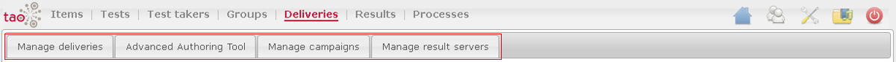

<!--
parent:
    title: User_Guide
author:
    - 'Jérôme Bogaerts'
created_at: '2011-03-11 16:22:56'
updated_at: '2013-03-13 15:13:58'
tags:
    - 'User Guide'
-->

{{\>toc}}

Deliveries
==========

The Deliveries part has four tabs:

1. [[Manage Deliveries]]
------------------------

The Manage Deliveries tab manages the deliveries list and the properties of these deliveries.\
The delivery creation is carried by the selection of test(s), the selection of group(s), the selection of test taker(s) to be excluded and the selection of campaign(s).

The main functions of this tab:

-   [[Deliveries library]]
-   [[Actions in Deliveries|Actions]]
-   [[Edit delivery class]]
-   [[Select delivery tests]]
-   [[Add to group in Deliveries|Add to group]]
-   [[Add to delivery campaign]]
-   [[Tests sequence]]
-   [[Select test takers to be excluded]]
-   [[Delivery properties]]
-   [[Translate in Deliveries|Translate]]
-   [[Compilation]]
-   [[History]]
-   [[Search in Deliveries|Search]]
-   [[Move to in Deliveries|Move to]]
-   [[Create table in Deliveries|Create table]]
-   [[Export in Deliveries|Export]]
-   [[Import in Deliveries|Import]]

2. [[Manage Campaigns]]
-----------------------

The Manage Campaigns tab manages the campaigns list and the properties of these campaigns.\
The campaign creation is carried by the selection of delivery(ies).

The main functions of this tab:

-   [[Campaigns library]]
-   [[Actions in Campaigns|Actions]]
-   [[Edit campaign class]]
-   [[Select delivery]]
-   [[Edit campaign]]
-   [[Translate in Campaigns|Translate]]
-   [[Search in Campaigns|Search]]
-   [[Move to in Campaigns|Move to]]
-   [[Create table in Campaigns|Create table]]
-   [[Export in Campaigns|Export]]
-   [[Import in Campaigns|Import ]]

3. [[Manage Result Servers]]
----------------------------

This tab manages the result servers list and the properties of these result servers.\
The result server creation is carried by the selection of delivery(ies).

The main functions of this section:

-   [[Result servers library]]
-   [[Actions in Result Servers|Actions]]
-   [[Edit result server class]]
-   [[Select delivery]]
-   [[Edit result server]]
-   [[Translate in Result Servers|Translate]]
-   [[Search in Result Servers|Search]]
-   [[Move to in Result Servers|Move to]]
-   [[Create table in Result Servers|Create table]]
-   [[Export in Result Servers|Export]]
-   [[Import in Result Servers|Import]]

4. Advanced authoring tool
--------------------------

The [[Deliveries Advanced authoring tool]] tab is only available if the Processes part is installed.\
This tab permits to create a complex list of tests.\
Indeed, without the Processes extension, it is only possible to create deliveries with a sequential list of tests.

