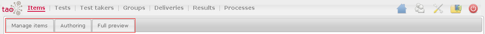

<!--
author:
    - 'Armando Estañol'
created_at: '2011-03-11 15:03:00'
updated_at: '2014-04-09 01:41:41'
tags:
    - 'User Guide'
-->

Items
=====

The Items part has three tabs:

1. [[Manage Items]]
-------------------

The Manage Items tab manages the items list and the properties of these items.

The main functions of this tab are:

-   [[Items library]]
-   [[Actions in Items|Actions]]
-   [[Edit item class]]
-   [[Edit item]]
-   [[Translate in Items|Translate]]
-   [[Manage item content]]
-   [[Search in Items|Search]]
-   [[Move to in Items|Move to]]
-   [[Create a list in Items|Create a list]]
-   [[Meta data in Items|Meta data]]
-   [[Create table in Items|Create table]]
-   [[Export in Items|Export]]
-   [[Import in Items|Import]]

2. [[Authoring]]
----------------

The Authoring tab allows you to edit the item previously selected in the Manage Items tab. The mode edition entirely depends on the chosen model.

The main functions of this tab are:

-   [[Authoring| QTI User Guide]][[QTI| QTI developers guide]]

3. [[Full Preview]]
-------------------

The Preview tab allows viewing the previously selected item in the Manage items tab.

The main function of this tab are:

-   [[Preview]]

Items
=====

The Items part has three tabs:

1. [[Manage Items]]
-------------------

The Manage Items tab manages the items list and the properties of these items.

The main functions of this tab are:

-   [[Items library]]
-   [[Actions in Items|Actions]]
-   [[Edit item class]]
-   [[Edit item]]
-   [[Translate in Items|Translate]]
-   [[Manage item content]]
-   [[Search in Items|Search]]
-   [[Move to in Items|Move to]]
-   [[Create a list in Items|Create a list]]
-   [[Meta data in Items|Meta data]]
-   [[Create table in Items|Create table]]
-   [[Export in Items|Export]]
-   [[Import in Items|Import]]

2. [[Authoring]]
----------------

The Authoring tab allows you to edit the item previously selected in the Manage Items tab. The mode edition entirely depends on the chosen model.

The main functions of this tab are:

-   [[Authoring| QTI User Guide]][[QTI| QTI developers guide]]

3. [[Full Preview]]
-------------------

The Preview tab allows viewing the previously selected item in the Manage items tab.

The main function of this tab are:

-   [[Preview]]

