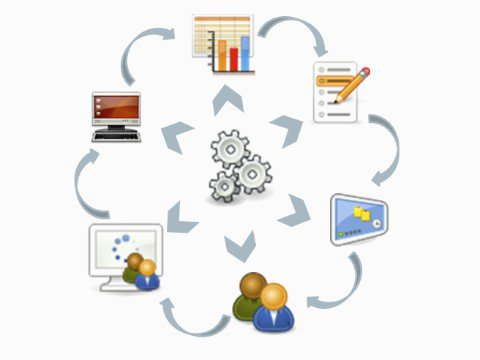
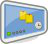
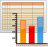

<!--
parent: 'Legacy User Guide'
created_at: '2011-03-11 11:52:47'
updated_at: '2013-03-13 13:13:36'
authors:
    - 'Jérôme Bogaerts'
contributors:
    - 'Franck Gismondi'
tags:
    - 'Legacy User Guide:Overview of TAO parts'
-->

Overview of TAO parts
=====================

*This section briefly presents the seven parts that constitute TAO.*

TAO is structured in independent parts to permit a flexible and versatile use of the platform:

 [Items](../user-guide/items.md)
----------------------------

This part manages the creation and design of items and exercises. 

Different design templates are proposed depending on the type of item you want to create.

 [Tests](../user-guide/tests.md)
----------------------------

This part manages the test creation. You can create a test by combining a selection of Items into a Test. 

You can also configure the test parameters: item order, scoring, layout, etc.

 Test takers
---------------------------------------

In this part, you can define who your test taker(s) are and manage their registration data. 

It also allows associating the selected test taker to the relevant group(s).

 [Groups](../user-guide/groups.md)
------------------------------

This part manages the groups creation, i.e., grouping test takers according to global features and classifications. 

You can assign the selected groups to the delivery(ies).

 [Deliveries](../user-guide/deliveries.md)
--------------------------------------

This part manages the test deliveries. 

The delivery creation is the process of assigning selected tests, and group(s) to a delivery campaign. 

At this stage, it is possible to exclude test taker(s) from the delivery apart from their group membership. 

You can also edit a set of properties: sequence, maximum number of executions, delivery period, etc., and define a delivery campaign.

 [Results](../user-guide/results.md)
--------------------------------

This part gives results of all delivered tests with their referring Test takers, Groups and Items specific data, as well as the individual data collected during Test execution. 

Here you can create tables to visualize the results and then export them for further data analysis.

 [Processes](../user-guide/processes.md)
------------------------------------

This part is optional. 

It manages the process creation and allows you to build processes to drive activities into workflow.

