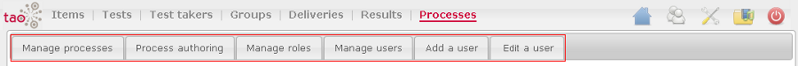

<!--
author:
    - 'Jérôme Bogaerts'
created_at: '2011-03-14 10:24:32'
updated_at: '2013-03-13 14:26:36'
tags:
    - 'User Guide'
-->

Processes
=========

The Processes extension manages the processes creation.\
The Processes extension allows creating processes, in a tutorial goal for example.\
This extension also manages the roles creation, the association of the selected role to user(s), and manages users (creation, modification and deletion).\
The Processes extension installation leads eight new sections (six sections are in the Processes extension, one in Test extension, one in Deliveries extension).

1. [[Manage Processes]]
-----------------------

This section manages the processes creation and the properties definition of these.

The main functions of this section:

-   [[Process library]]
-   [[Actions in Processes|Actions]]
-   [[Process properties in Processes|Process properties]]
-   [[Search in Processes|Search]]
-   [[Meta data in Processes|Meta data]]
-   [[Create table in Processes|Create table]]
-   [[Export in Processes|Export]]

2. [[Process Authoring]]
------------------------

This section allows editing the previously selected process in the Manage processes section.

The main functions of this section:

-   [[Service definition]]
-   [[Formal parameter]]
-   [[Role]]
-   [[Process variables]]
-   [[Process diagram]]
-   [[Activity editor]]
-   [[Process properties]]
-   [[Compilation]]

3. [[Manage Roles]]
-------------------

This section manages the roles creation.\
It is also possible to assign user(s) to role.

The main functions of this section:

-   [[Role library]]
-   [[Actions in Roles|Actions]]
-   [[Assign user to role]]
-   [[Edit role]]
-   [[Search in Roles|Search]]
-   [[Meta data in Roles|Meta data]]
-   [[Create table in Roles|Create table]]
-   [[Export in Roles|Export]]

4. [[Manage Users]]
-------------------

This section allows having an overview of the platform users and the users specifically create for the Processes extension.\
This section also permits adding, editing and deleting users.

The main function of this section:

-   [[Workflow users]]

5. [[Add a User]]
-----------------

This section allows you to respond to various fields of properties for the creation of a user.

The main function of this section:

-   [[Add a user]]

6. [[Edit a User]]
------------------

This section allows changing the responses in the various fields of properties needed to create a user.

The main function of this section:

-   [[Edit a user]]

7. [[Tests Advanced authoring tool]] (in the Tests part)
--------------------------------------------------------

8. [[Deliveries Advanced authoring tool]] (in the Deliveries part)
------------------------------------------------------------------

Processes
=========

The Processes extension manages the processes creation. 

The Processes extension allows creating processes, in a tutorial goal for example. 

This extension also manages the roles creation, the association of the selected role to user(s), and manages users (creation, modification and deletion). 

The Processes extension installation leads eight new sections (six sections are in the Processes extension, one in Test extension, one in Deliveries extension).

1. [[Manage Processes]]
-----------------------

This section manages the processes creation and the properties definition of these.

The main functions of this section:

-   [[Process library]]
-   [[Actions in Processes|Actions]]
-   [[Process properties in Processes|Process properties]]
-   [[Search in Processes|Search]]
-   [[Meta data in Processes|Meta data]]
-   [[Create table in Processes|Create table]]
-   [[Export in Processes|Export]]

2. [[Process Authoring]]
------------------------

This section allows editing the previously selected process in the Manage processes section.

The main functions of this section:

-   [[Service definition]]
-   [[Formal parameter]]
-   [[Role]]
-   [[Process variables]]
-   [[Process diagram]]
-   [[Activity editor]]
-   [[Process properties]]
-   [[Compilation]]

3. [[Manage Roles]]
-------------------

This section manages the roles creation. 

It is also possible to assign user(s) to role.

The main functions of this section:

-   [[Role library]]
-   [[Actions in Roles|Actions]]
-   [[Assign user to role]]
-   [[Edit role]]
-   [[Search in Roles|Search]]
-   [[Meta data in Roles|Meta data]]
-   [[Create table in Roles|Create table]]
-   [[Export in Roles|Export]]

4. [[Manage Users]]
-------------------

This section allows having an overview of the platform users and the users specifically create for the Processes extension. 

This section also permits adding, editing and deleting users.

The main function of this section:

-   [[Workflow users]]

5. [[Add a User]]
-----------------

This section allows you to respond to various fields of properties for the creation of a user.

The main function of this section:

-   [[Add a user]]

6. [[Edit a User]]
------------------

This section allows changing the responses in the various fields of properties needed to create a user.

The main function of this section:

-   [[Edit a user]]

7. [[Tests Advanced authoring tool]] (in the Tests part)
--------------------------------------------------------

8. [[Deliveries Advanced authoring tool]] (in the Deliveries part)
------------------------------------------------------------------

