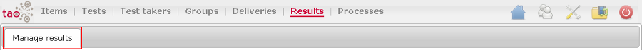

<!--
parent:
    title: User_Guide
author:
    - 'Jérôme Bogaerts'
created_at: '2011-03-14 09:11:31'
updated_at: '2013-03-13 14:22:51'
tags:
    - 'User Guide'
-->

Results
=======

The Results part has one section:

[[Manage Results]]
------------------

The Manage results section manages the results list and the properties of these results. All results are added automatically after passing the test(s).\
The results stores are visible by the table creation.\
There are options to automatically create a table with for example all properties or only the score properties and there is an option to freely create a table by the manual selection of properties.

The main functions of this section:

-   [[Results library]]
-   [[Actions in Results|Actions]]
-   [[Edit result class]]
-   [[Edit result]]
-   [[Translate in Results|Translate]]
-   [[Create direct table]]
-   [[Create score table]]
-   [[Create table in Results|Create table]]

