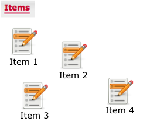
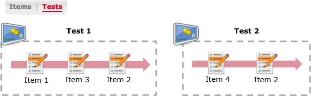
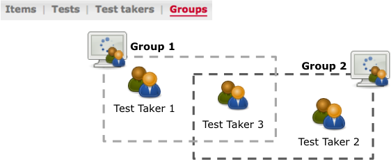
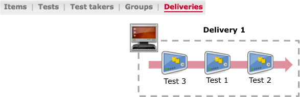
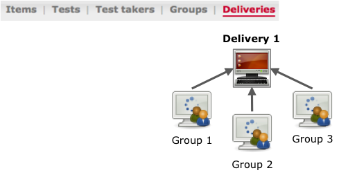

<!--
parent:
    title: User_Guide
author:
    - 'Jérôme Bogaerts'
created_at: '2011-12-01 15:10:37'
updated_at: '2013-03-13 13:14:10'
tags:
    - 'User Guide'
-->

Steps to create an assessment
=============================

{{\>toc}}

To manage the different steps of the computer based assessment processes, you have to:

1. In Items part, create items
------------------------------

p((((. 

2. Then in Tests part, group and order items into tests
-------------------------------------------------------

p((((. 

3. In Test takers part, create test takers
------------------------------------------

p((((. 

4. Then in Groups part, group test takers into groups
-----------------------------------------------------

p((((. 

5. In Deliveries part, group and order tests into deliveries
------------------------------------------------------------

p((((. 

6. Also in Deliveries part, assign groups to deliveries
-------------------------------------------------------

p((((. 

7. And in Results part, access, view and export the collected results
---------------------------------------------------------------------

p((((. 

