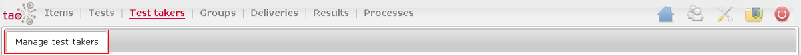

<!--
parent:
    title: User_Guide
author:
    - 'Jérôme Bogaerts'
created_at: '2011-03-11 15:48:20'
updated_at: '2013-03-13 13:40:27'
tags:
    - 'User Guide'
-->

Test Takers
===========

The Test takers part has one tab:

[[Manage Test Takers]]
----------------------

The Manage Test Takers tab manages the test takers list (test takers registration) and the properties of these test takers. 

This tab also allows the association of the selected test taker to group(s).

The main functions of this tab are:

-   [[Test takers library]]
-   [[Actions in Test takers|Actions]]
-   [[Edit test taker class]]
-   [[Add to group]]
-   [[Edit test taker]]
-   [[Search in Test takers|Search]]
-   [[Move to in Test takers|Move to]]
-   [[Create a list in Test takers|Create a list]]
-   [[Meta data in Test takers|Meta data]]
-   [[Create table in Test takers|Create table]]
-   [[Export in Test takers|Export]]
-   [[Import in Test takers|Import]]

