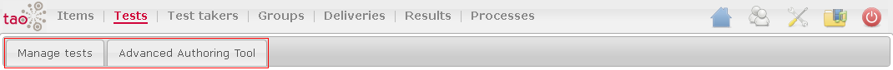

<!--
parent: 'Legacy User Guide'
created_at: '2011-03-11 15:24:21'
updated_at: '2013-03-13 13:35:48'
authors:
    - 'Jérôme Bogaerts'
contributors:
    - 'Franck Gismondi'
tags:
    - 'Legacy User Guide:Tests'
-->

Tests
=====

The Tests part has two tabs:

1. Manage Tests
-------------------

The Manage tests tab manages the tests list and the properties of these tests. 

And, the test creation consists by the items selection and by the choice of their order.

The main functions of this tab are:

-   Tests library
-   Actions in Tests|Actions
-   Edit test class
-   Select related items
-   Items sequence
-   Test properties
-   Translate in Tests|Translate
-   Search in Tests|Search
-   Move to in Tests|Move to
-   Create a list in Tests|Create a list
-   Meta data in Tests|Meta data
-   Create table in Tests|Create table
-   Export in Tests|Export
-   Import in Tests|Import

2. Advanced authoring tool
--------------------------

The Tests Advanced authoring tool tab is only available if you installed Processes part. 

This tab permits to create a complex list of items. 

Indeed, without the Processes tab, it is only possible to create tests with a sequential list of items.

