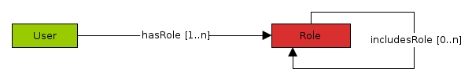
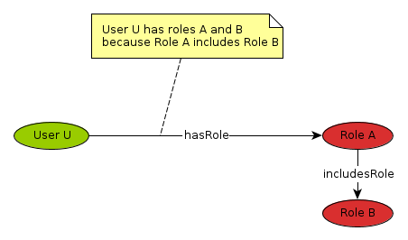
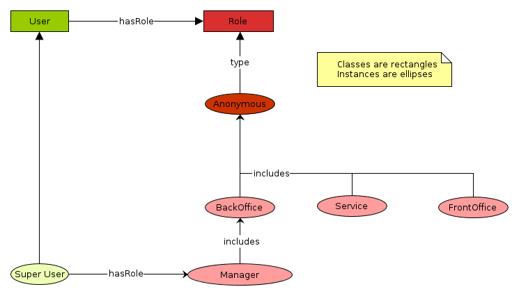
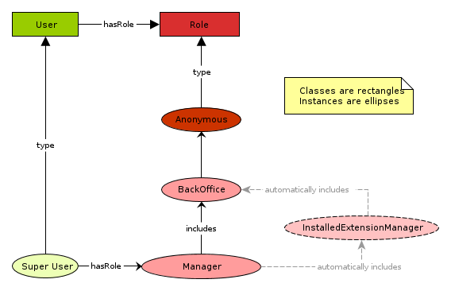

<!--
parent: 'Users Management Model'
created_at: '2013-03-07 09:35:51'
updated_at: '2013-03-13 12:59:54'
authors:
    - 'Jérôme Bogaerts'
tags:
    - 'Users Management Model'
-->

Users Management Model for TAO versions 2.4 and later
=====================================================

1. Introduction
---------------

TAO 2.4 introduces a new Users Management Model which is more clear, flexible and configurable. You will find in this Wiki page all the information needed to seamlessly understand and use it.

2. Major concepts
-----------------

The Users Management Model of TAO is basically built upon two major concepts: *Users* and *Roles*.

-   A *User* is given *1* to *many* *Roles*
-   *Roles* may include *0* to many *Roles*.

In addition, the following business logic is applied to them.

-   If a user *U* is given a role *A* which includes role *B*, then *U* has roles *A* and *B*.

### 2.1. Users

Users in TAO are represented as instances of the *User* class. This class is structured as it follows.

-   **Label**: User
-   **URI**: tao:User
-   **subClassOf**: generis:User

  Property Label            Property URI            Range               Definition
  ------------------------- ----------------------- ------------------- ---------------------------------------
  Label                     rdfs:label              rdfs:Literal        The label of the user
  Comment                   rdfs:comment            rdfs:Literal        The comment about the user
  First Name                generis:userFirstName   rdfs:Literal        The first name of the user
  Last Name                 generis:userLastName    rdfs:Literal        The last name of the user
  Login                     generis:login           rdfs:Literal        The login of the user
  Password                  generis:password        rdfs:Literal        The password of the user (md5 hash)
  Mail                      generis:userMail        rdfs:Literal        The e-mail address of the user
  Data Language             generis:userDefLg       tao:Languages       The default data language of the user
  User Interface Language   generis:userUILg        tao:Languages       The default GUI language of the user
  Roles                     generis:userRoles       generis:ClassRole   The Role(s) of the user

### 2.2. Roles

Roles in TAO are represented as instances of the *Role* class. This class is structured as it follows.

-   **Label**: Role
-   **URI**: generis:ClassRole
-   **subClassOf**: generis:generis_Ressource

  Property Label   Property URI           Range               Definition
  ---------------- ---------------------- ------------------- --------------------------------------
  Label            rdfs:label             rdfs:Literal        The label of the role
  Comment          rdfs:comment           rdfs:Literal        The comment about the role
  Includes Roles   generis:includesRole   generis:ClassRole   Roles that are included by the roles

3. Use Cases
------------

You might wonder why this Users and Roles Management Model exists, and to what it is used for. Actually it was designed to achieve two particular use cases:

-   **Users Authentication**: Authenticate users against the system in multiple contexts (Management, Delivery, Workflows)
-   **Functionality Access Control**: Grant access or not to users depending on the roles they were given.

### 3.1. Users Authentication

To authenticate a user against the system the login and password property values of the user are used in addition with the roles it had been given.

For instance, the *TAO meta-extension* which is the main access to the *TAO Back Office*. To allow a user to be identified against the system and access the *TAO Back Office*, it will

-   Check if the provided **login** and **password** values can be **matched** in the persistent memory.
-   Check if the user found in persistent memory that matches login and password values **has** the **Back Office** role directly or by role(s) inclusion.

If these two conditions are met, the user is indeed authenticated against the *TAO Back Office*.

### 3.2. Functonality Access Control

When your user is authenticated, you might want to know what are the features he can access or not. Our Users Management Model takes this in consideration by extending the concept of Role. For each Role, administrators will be able to define what are the functionalities that can be accesssed.

The **TAO Functionality Access Control** is too much substantial to be entirely covered in this introduction to the Users Management Model of TAO. In a nutshell, Roles can be granted to entire MVC Modules of TAO Extensions (corse-grained control) or to single MVC Actions (fine-grained control).

Feel free to visit the dedicated Functionality_Access_Control|Wiki page covering TAO Functionality Access Control if you want to learn more about it.

4. Users and Roles Base Map
---------------------------

Now that you know the basics of Users and Roles in TAO, you can now discover the Users and Roles **Base Map**. The most basic TAO running platform possible is made of the *TAO meta-extension* on its own. You will not be able to do a lot of things with a such basic installation of course but it is a good start to understand how TAO implements the *Users* and *Roles* concepts and how they are linked together.

The *Users* and *Roles* model that is generated at TAO meta-extension installation time is called the **Base Map**. It contains all the roles and users needed to install and manage other extensions in order to make your TAO platform growing up in size and features. The Base Map contains **Abstract Roles** that will be included by more concrete roles that will be gradually be created by additional extensions but also the **Manager Role** that will be given to the TAO Platform **Super User**.

Let us describe a bit more further the concepts shown on the figure above.

-   **Anonymous Role**: This role is the most basic role you can give to a user in TAO.
-   **BackOffice Role**: This role will be given to users that can access to extensions that are part of the *TAO Back Office*.
-   **FrontOffice Role**: This role will be given to users that can access to extensions that have a *Front Office* part, such as the *taoDelivery* extension.
-   **Service Role**: A specific role that will be given to users that should have access to Web Services provided by TAO Extensions.
-   **Manager Role**: The Manager Role is a specific role that is given to *Super Users* only. Each time a TAO Extension is installed on your platform, it will be given access to all the features it. We will see this aspect more in details later on.

5. The Manager Role
-------------------

As seen previously, the **Manager Role** is very important role. Indeed, any time a TAO Extension is installed on your platform, the Manager Role will be given access to all the functionalities provided by the installed extension. How does this work.

Actually, when a TAO extension is installed, a dedicated **Extension Management Role** which includes the **BackOffice Role** is created for this extension, with all permissions on its functionalities. After the creation of this role dedicated to the extension’s management, the role is included by the **Manager Role**. As a result, all users that have been given the **Management Role** will be automatically granted an entire access to the installed extension.

6. TAO Open Source Distribution Users Management Model
------------------------------------------------------

Now that you are familiar with Users and Roles in TAO, we will now describe the Users Management Model as it comes with a fresh TAO Open Source distribution. This particular TAO distribution is composed of multiple extensions that enables end users to manage a complete Assessment Cycle, from Test Takers creation to Test Delivery.

{{thumbnail(newmodel-2013.png, size=700, title=TAO Open Source Distribution Management Model)}}

7. Related Readings
-------------------

-   Functionality_Access_Control|Functionality Access Control

