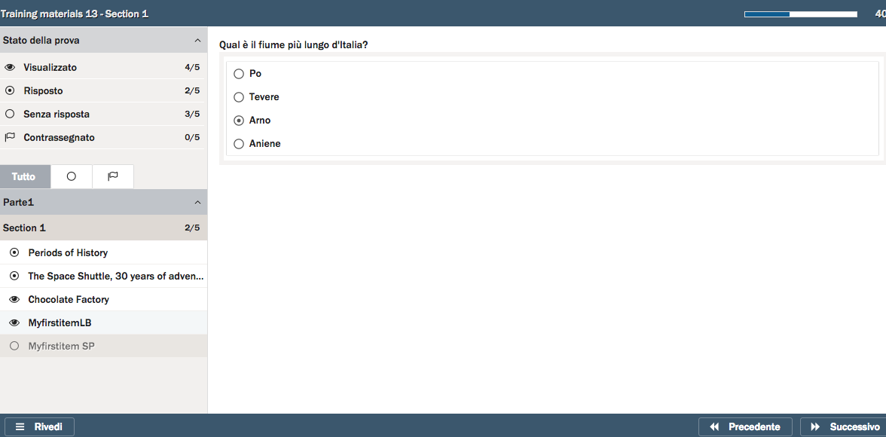
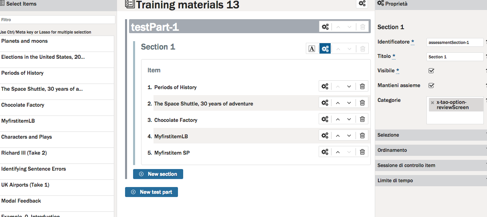

<!--
created_at: '2016-04-27 11:52:02'
updated_at: '2016-10-11 10:36:23'
authors:
    - 'Christophe Noel'
contributors:
    - 'Patrick Plichart'
tags:
    - Wiki
-->

Enable Qti test runner features
===============================

Setting the following categories in the QTI test creator unlocks secret features:

x-tao-option-endTestWarning
---------------------------

displays a warning before the user finishes the test\
requires Sprint 36 / taoQtiTest  
>= 5.20.0

x-tao-option-nextSectionWarning
-------------------------------

displays a next section button that warns the user that they will not be able to return to the section

x-tao-option-noExitTimedSectionWarning
--------------------------------------

disable the warning automatically displayed upon exiting a timed section\
requires Sprint 37 / taoQtiTest  
>= 5.24.0

x-tao-option-nextSection
------------------------

displays a next section button

x-tao-option-exit
-----------------

displays an exit button

x-tao-option-markReview
-----------------------

displays a mark for review button.

This option requires requires the *x-tao-option-reviewScreen* option.

x-tao-option-reviewScreen
-------------------------

displays the review screen / navigator. example : 

This option requires a modification to the **/config/taoQtiTest/testRunner.conf.php** file. Please find the line:

        'test-taker-review' => false,

and replace it with:

        'test-taker-review' => true,

x-tao-option-calculator
-----------------------

enable calculator

How to configure those options at the level of a particular test ?
------------------------------------------------------------------

You may enable those features at the level of a test by adding the relevant category in the test authoring next to the section level settings pane.

