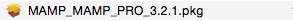
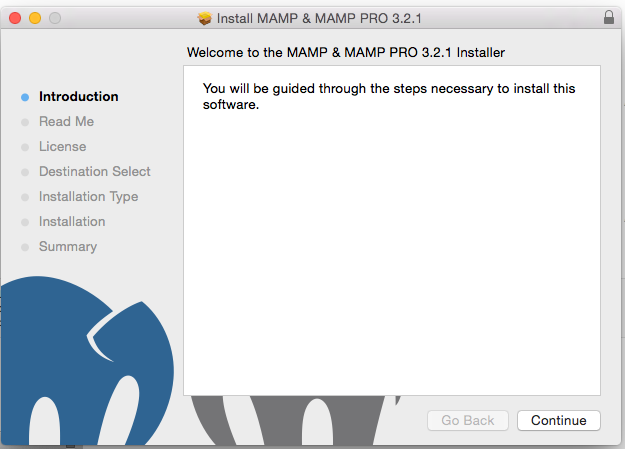
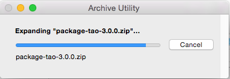
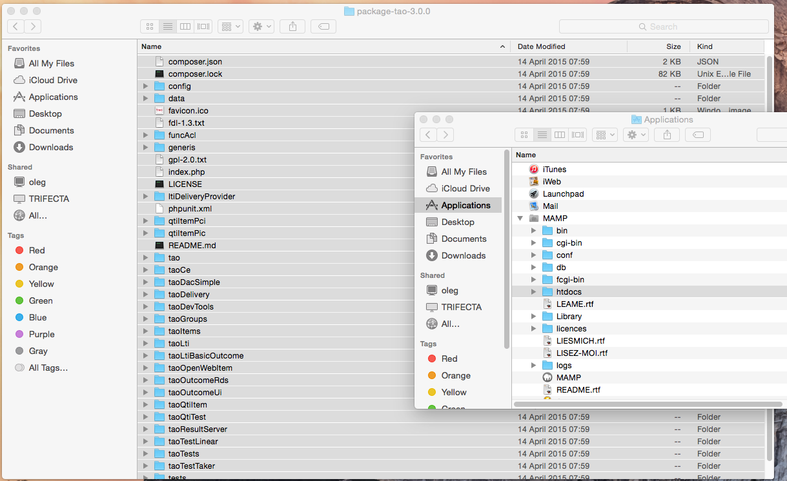
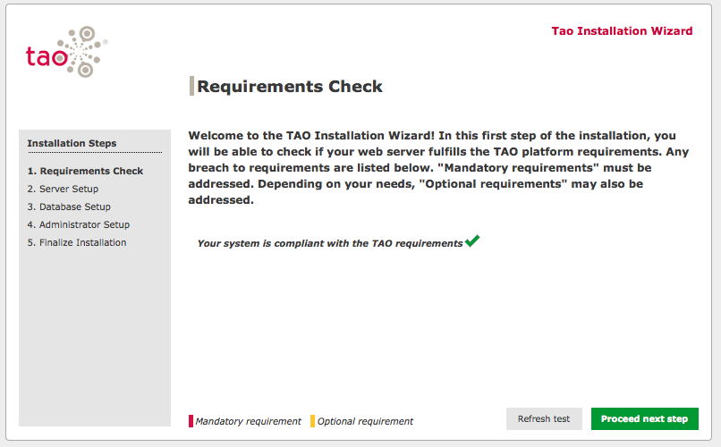
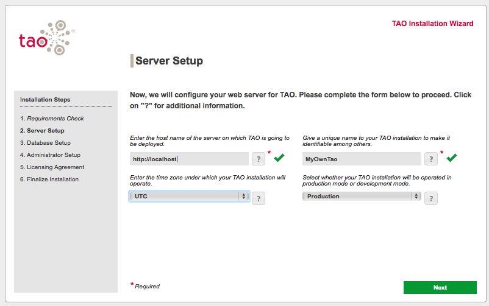
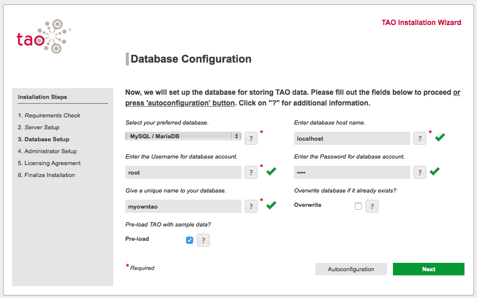
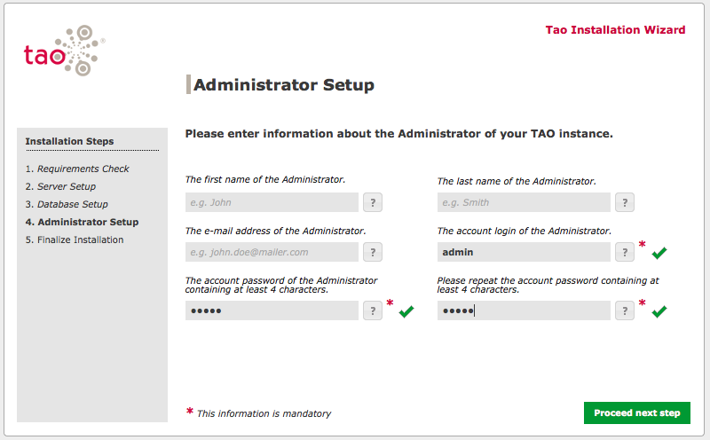
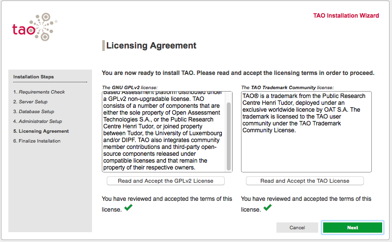

<!--
parent:
    title: Wiki
author:
    - 'Cyril Hazotte'
created_at: '2013-05-03 09:09:13'
updated_at: '2016-11-04 16:28:03'
tags:
    - Wiki
-->

{{\>toc}}

Install TAO on your Mac tutorial
================================

Let’s install TAO on your Mac, we don’t provide yet a self-installable package for Mac but do not panic, it is easy !

Let’s:

1.  Install MAMP
2.  Copy the TAO Files in the appropriate folder
3.  Configure/Install TAO itselfs

Install the web server (MAMP installation)
------------------------------------------

Go on the MAMP home page and download the free MAMP version,\
You may notice that MAMP comes bundled with MAMP PRO,\
 however we don’t really need this and you may ignore the MAMP PRO and continue with MAMP.

https://www.mamp.info/en/downloads/

    # Double click the downloaded .pkg file to start the MAMP (web server) installation
    By default the downloaded .pkg file will be located into your Downloads folder

    # Proceed with the Mamp installation using the default options unless you know what you are doing 
    (So click on "Continue", until you reach the end)
    # Agree to the license terms
    # When you are prompted for how to install the software, you may have to confirm by clicking on the "install for all users"
    # You may also be prompted for a password: this is the password of an administrator account of your Mac

Congratulations! You have now your MAMP successfully installed, you may now launch it.

    # Double click the MAMP icon from your Applications directory (located at /Applications/MAMP/or from your dock bar)
    # You may be suggsted by MAMP vendor to switch to a pro version, for the purpose of this tutorial, we recommend you to stick to the normal MAMP version
    # Click the "Start servers", the boxes near "Apache server" and "MySQL server" in the top right corner should switch to green ones

Starting the MAMP installation…

Install TAO into your MAMP
--------------------------

You need now to download all tao files and copy it into your MAMP.\
Please download one of these build packages:

-   http://releases.taotesting.com/TAO\_3.0.0\_build.zip
-   http://releases.taotesting.com/TAO\_3.1.0-RC3\_build.zip

1.  `Extract it and open the extracted folder (by default the directory where it is extracted
    is along your zip file into the Downloads directory)`

    # You need now to copy all the files from the downloaded archive into your /Applications/MAMP/htdocs folder.
     (You may do a drag and drop of the files. Make sure you obtain the directories "generis", "tao", "taoItems" under /Applications/MAMP/htdocs

    Warning : there are files that are considered as system file by Mac and are not always visible in the finder.. Those files are extracted by the built in archive utility, however, if they are hidden, they won't be selected during the drag and drop and won't be copied . This will result into a *file not found error message* after installation. 

    For example, you should have a file called ".htaccess" in the root folder.

    Make sure you either extract the original files using an apporiate zip extracting utility with the htdocs destination or that you have turned on the the mode from MAC for hidden file so that your selection covering all the files.  

    If you meet this issue, we recommend using an appropriate zip extraction utility such as http://www.izip.com/ and ensure you extract the downloaded zip files directly into your /Applications/MAMP/htdocs folder

Install TAO itselfs
-------------------

Come back to your web browser that popped up when you started your MAMP server (you may also launch another web browser and type in the adress to tao)

    # Connect at this adress http://localhost:8888/tao/install 
    (please note that the server port may change depending on your settings into the MAMP preferences for ports
     example : http://localhost/tao/install)
    # Complete the tao installation procedure (standard procedure)

\
Define the hostname, commonly it is http://localhost:8888 but it could be http://localhost depending on the settings set up in your MAMP. If you are not sure check the adress used in your web browser as a reference.

We recommend you to use the pre-load data sample option, this way you will have some basic item examples to start with.

\
Please note that the default login and password to access mysql from MAMP is root/root

\
Choose an admin account for your tao installation, this is the login and password you will have to use on your fresh tao installation.

\
Read and accept to license agreements.

\
Congratulations!

### Start up TAO

In order to Launch TAO, you need to have MAMP started, the servers started and a web browser opened to the locahost:8888 url.\
You may ease this work by fine tuning your MAMP.

Optionnaly, we recommend you to do the following configuration :

1.  We recommend you to click the preferences button into MAMP.
2.  Switch to the start/stop tab.
3.  Check the options telling MAMP to automatically start servers when starting MAMP.
4.  Replace within the launch page url field with “/” instead of “/MAMP/”
5.  Drag an drop the MAMP executable into your dock back

This way you may launch tao by simply clicking the MAMP icon from your dock bar.

### Troubleshooting

-   Mamp does not start correctly, the Apache Server status does not switch on

You may have already a server running on your local system and conflicting with MAMP. You will have to go into the preferences/ports and choose an alternate port to run your MAMP server/

-   I have MAMP running correctly but when I go on http://localhost/tao/install I get a 404 error.

You may have incorrectly copied the files into your htdocs directory after you have extracted the tao zip file. Make sure you extract it correctly with all the directory structure and directly under the /Applications/MAMP/htdocs folder

-   I copied pasted some content found on the web into the QTI authoring tool and the item looks weird or I have some errors.

This is a drawback of this tutorial that circumvents some components (see Disclaimer), it is recommended not to use copy paste with this installation into your items. If ever, you encounter such problems, report them in our forge and mention that you used this tutorial to help our investigations.

-   I have MAMP and TAO running correctly but, when I try to Start a test, I see the banner and no questions/items appear.

If you see a 505 error message in the browser console, this is likely due to MAMP running PHP 7, which is not yet supported. In the MAMP preferences ensure that you are running PHP 5. You may need to stop and start the server for this to take effect.

-   How do I get started handling TAO?

You may want to have a short webinar introduction to TAO, check our website and ask for a 1:1 demo

Patrick

