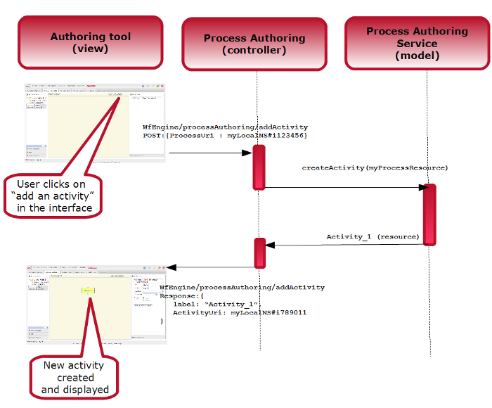

<!--
parent: 'Workflow Engine'
created_at: '2011-03-02 18:09:08'
updated_at: '2013-03-13 13:03:18'
authors:
    - 'Jérôme Bogaerts'
contributors:
    - 'Somsack Sipasseuth'
tags:
    - 'Workflow Engine'
-->

Process Creation tool
=====================

(see: User Guide )

With TAO, you will have the opportunity to implement the process authoring tool, based on the previously introduced process authoring service.

It uses the Models|MViews|VControllers|C php Framework|framework of TAO.

