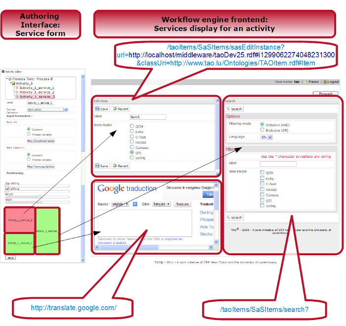
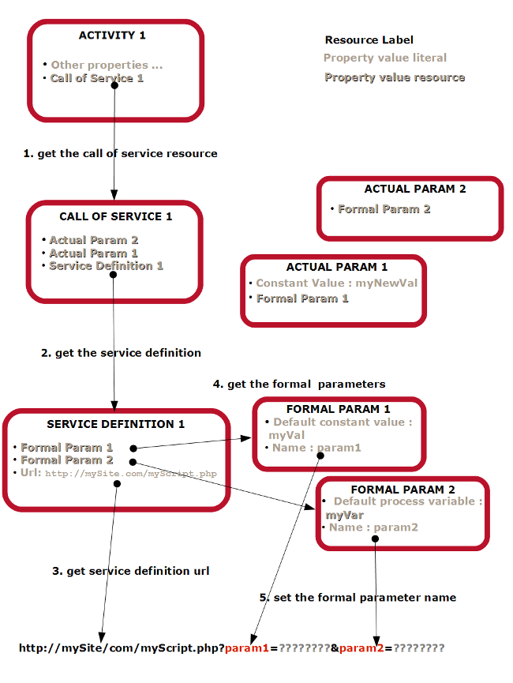
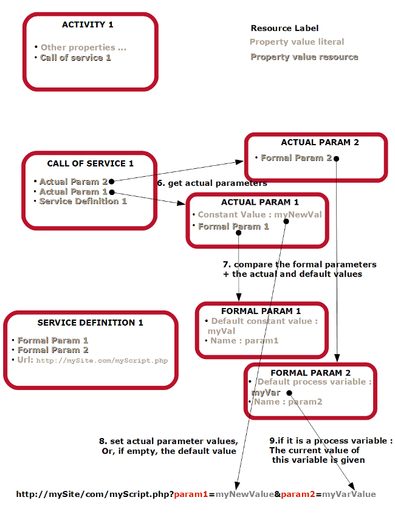
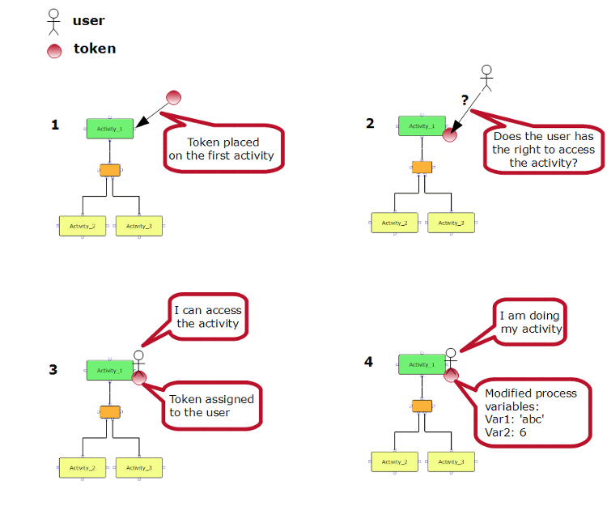
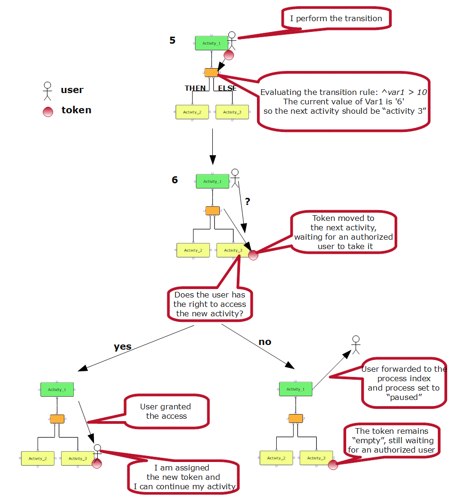

<!--
parent:
    title: Workflow_Engine
author:
    - 'Jérôme Bogaerts'
created_at: '2011-03-02 18:18:41'
updated_at: '2013-03-13 13:03:34'
tags:
    - 'Workflow Engine'
-->

Execution of a process
======================

1. Init a process execution
---------------------------

A process execution is initiated in the ProcessExecutionFactory: *wfEngine\_models\_classes\_ProcessExecutionFactory*\
It consists in:\
- creating a process execution resource\
- finding the first activity from the process definition\
- creating an empty token and places it on the first activity\
- setting the initial process variables values in that token (see token)

2. Running an activity
----------------------

### 2.1. From the activity definition to the screen display

From an activity definition, the current user’s credential is checked against the access control mode of that activity. (see: [[userService+authentification part]]) If the user has the right to access the activity, an activity execution is created.\
And the so called activity is executed. This means that the system simply fetches the list of services in that activity and inserts each of them in an iframe. See ProcessBrowser controller.

The image below shows 3 services displayed for an activity:\

The picture above shows that all three services have a different url, one of which has some parameters. The url is indeed processed and built for each service according to the process described as follows:\
\

### 2.2. Activity Execution resource

\
The property *“finished”* tells if that activity execution has been finished, i.e., if the owning user has performed a *“transition”* (see the description of a *“transition”* in the following section).\
The property “activity definition” tells which activity definition the current activity execution is the execution of.\
An activity execution is owned by a single user only.\
An activity execution provides the context recovery.

3. Process status and tokens
----------------------------

Tokens keep the current context of execution. It moves along the process, to tell the process execution its current position in its process flow. It can move both forward and backward, according to the action triggered by the user.\
(img: diagram to illustrate a flow, and a diagram moving)

A token is created as soon as a transition is performed. The token is aimed at being taken by a user who has the right to access the activity. Once the token is assigned to the right user, the latter becomes the owner of the token and the only one allowed to move the token.\
\

Tokens also play the role of saving the current values of the process variables. Activity services or connector transition rules (see [[Process Definition Model\#conditional|conditional connector & transition rule]]) use process variable respectively to set input parameter values and to evaluate the transition rules. Tokens therefore provide a very good snapshot of a process execution, and a helpful resource for process execution debugging.

Each time a process variable is created, it automatically becomes a property of the token class. Therefore a token instance will be able to “carry” the value of the newly created process variable with it.\
For more technical details about the way the token is set and moved, see [the phpDoc of the TokenService](http://forge.tao.lu/docs/phpdoc/wfEngine/models_classes/wfEngine_models_classes_TokenService.html).

4. Perform transition
---------------------

Perform transition is a method of the *wfEngine\_models\_classes\_ProcessExecution* class. This function is called each time a *transition* from the current activity to the following one and it is executed.\
It calls the *wfEngine\_models\_classes\_ProcessExecution::getNewActivities()* to get the list of the following activities. The *getNewActivities()* function evaluates the transition condition for each type of connector:\
- sequential: immediate transition to the next for a sequential one\
- conditional: evaluate the transition rule to define the next activity (following the “then” or “else” branch?)\
- parallel: how many activities (i.e., branches) would be created?\
- join: are every user finished with their activities in their branches?\
Finally the [TokenService](http://forge.tao.lu/docs/phpdoc/wfEngine/models_classes/wfEngine_models_classes_TokenService.html) is called to move the tokens from the current activity to the next one: the values of process variables will be transferred while the activity executions and user will be reset so the token are ready to be *“taken”* by users at the following step.

