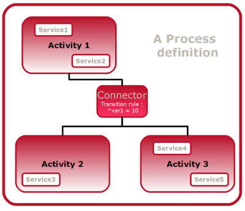
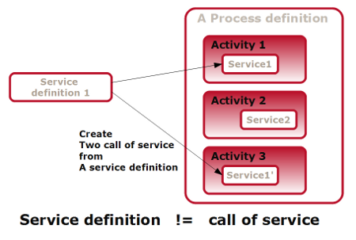
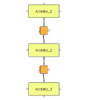
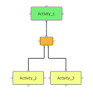
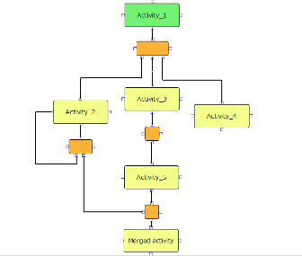

<!--
created_at: '2011-03-02 15:29:09'
updated_at: '2013-03-13 13:01:08'
authors:
    - 'Jérôme Bogaerts'
contributors:
    - 'Somsack Sipasseuth'
tags:
    - 'Workflow Engine'
-->

Process Definition Model
========================

1. Process definition
---------------------

A process resource is built with 2 main types of resources, i.e., activities and connectors.

The activities define one or more actions to be performed at a given step of the process flow. 

The connectors link several activities together to define the process flow.

A basic representation of simple conditional process can be found on the diagram below\

2. Activity definition
----------------------

An activity defines one or several actions to be performed on a given step of the process flow. Going through the process means jumping from one activity to another, from the first to the last one. 

An activity can be seen as the container of one or several services. As a container, the purpose of an activity is to define access rights. It allows addressing the issue: “When I arrive at this point of the process, am I allowed to execute the related actions?”.

The Generis Overview|Generis representation of an activity class below shows its properties: 

 

You can define the access control mode, whether it should be hidden or not (typically for a system activity that should not be visible by the end user) and whether the user can move forward or backward in the process execution interface.

Each activity can be given an access control mode, to control how the limitation is managed in each case. 

Four types of access control modes are currently implemented: 

1- Role: all users with the right role can access it (however, the first user to access it becomes the owner of the activity and the only one able to access it later) 

2- Role restricted user: identical to the previous mode, but applies to parallel branches only\
3- Role restricted user inherited: it behaves initially like the “role restricted user”: however, once an activity with the right role has been executed by a user, all other activities with that access mode and that selected role will only be accessible by that user. (This mode is useful for a delivery since all items of a test must be taken only by a single and unique user) 

4- User: only the designated user will be granted the access to the service

An activity can be considered as an empty container of services. The actual business, actions to be executed, is defined within the services. An activity can contain one or several services.

3. Service definition & call of service
---------------------------------------

### 3.1. Service definition

The services define the actual business of an activity: « when I get access to an activity, what will be executed and/or displayed on the screen and what should/could I do? » 

Services in the workflow engine are defined by a URL. It means that all scripts accessible through a URL could be a service. 

A service could have input parameters. It allows the process creator to tell the systems which parameter shall be passed as a parameter of the service. A service definition must be given the input parameters that it needs to work. The definition of such a parameter is called “formal parameter”. 

At runtime, the URL is opened in an iframe HTML element and all parameters values given via the HTTP GET method.

### 3.2. Call of service

A service created in an activity is a *“Call of Service”*. A call of service is the implementation of a service definition. A call of service is therefore associated to a service definition and the actual parameters define the values of the formal parameters of the service definition. 

A call of service is the service definition + the values of parameters +into a specific activity.

The image below illustrates the difference between a service definition (*“service definition 1”*) and its associated call of services (*“service 1”* and *“service 2”*): 

4. Connector definition
-----------------------

Connectors link activities together and thus define the logic of the process flow. A connector connects a unique previous activity to one or more following activities, according to its type. There are currently four types of connectors in TAO, two of them are yet at an experimental stage.

### 4.1. sequential:

A connector that links the previous activity to the unique following one. 

### 4.2. conditional:

A connector that links the previous activity to two others. At runtime, the workflow engine evaluates which activity should be the next one according to the transition rule. Therefore, a transition rule has to be defined for this type of connector. 

### 4.3. parallel (experimental):

A connector that allows parallelization of the process. It divides the process flow into multiple parallel threads. Each thread can be executed independently and simultaneously by different users. (see the same diagram as join connector below).

### 4.4. join (experimental):

This complementary connector of the parallel one allows joining several parallel process branches to a unique one. In order to proceed to the transition, it will wait for all branches to get to this connector. The fastest users who have completed the activity of their branch will be paused. 

